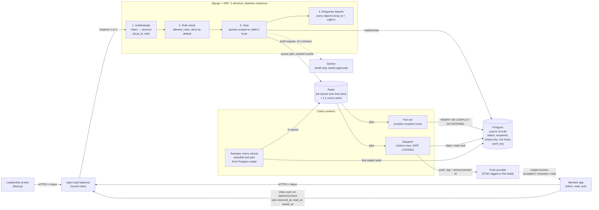

# CrewLink: architecture diagram

Referenced from [DESIGN.md](DESIGN.md), Part A section 4. GitHub renders the Mermaid block below.

```mermaid
flowchart LR
  L["Leadership screen<br/>(Next.js)"]
  M["Member app<br/>(inbox, read, ack)"]
  LB["nginx load balancer<br/>(round-robin)"]

  subgraph API["Django + DRF: 2 identical, stateless instances"]
    direction TB
    AUTH["1. Authenticate<br/>token → account<br/>(local_id, role)"]
    PERM["2. Role check<br/>allowed_roles, deny by default"]
    VIEW["3. View<br/>queries scoped to caller's local"]
    TRIP["4. Response tripwire<br/>every object's local_id = caller's"]
    AUTH --> PERM --> VIEW --> TRIP
  end

  PG[("Postgres<br/>source of truth<br/>status, recipients,<br/>unique key, row locks,<br/>push_log")]
  R[("Redis<br/>job queue (can lose jobs)<br/>+ 2 s count cache")]

  subgraph CEL["Celery workers"]
    FO["Fan-out<br/>(creates recipient rows)"]
    DW["Dispatch<br/>(claims rows, SKIP LOCKED)"]
    SW["Sweeper, every minute<br/>(rebuilds lost jobs<br/>from Postgres state)"]
  end

  P["Push provider<br/>(FCM; logged in this build)"]
  G["Gemini<br/>(draft only, needs approval)"]

  L -->|"HTTPS + token"| LB
  M -->|"HTTPS + token"| LB
  LB -->|"instance 1 or 2"| AUTH
  VIEW -->|"reads/writes"| PG
  VIEW -->|"queue jobs, cached counts"| R
  VIEW -.->|"draft request, 10 s timeout"| G
  R -->|"jobs"| FO
  R -->|"jobs"| DW
  FO -->|"INSERT ON CONFLICT DO NOTHING"| PG
  DW -->|"claim, mark sent"| PG
  DW -->|"push, tag = announcement id"| P
  P -.->|"maybe buzzes:<br/>accepted ≠ received ≠ read"| M
  M -->|"inbox sync on open/reconnect<br/>sets received_at, read_at, acked_at"| LB
  SW -->|"find stalled work"| PG
  SW -->|"re-queue"| R
```
